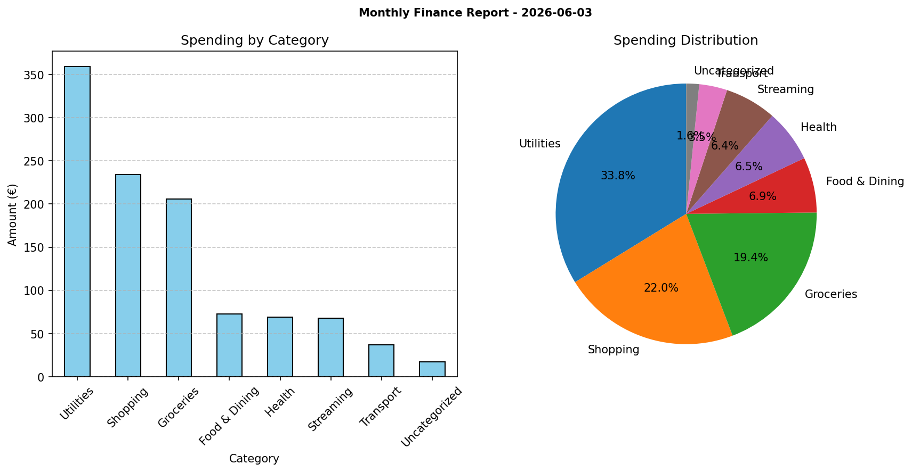

# Finance Dashboard

A Python finance dashboard for analyzing transaction CSV data, categorizing expenses, generating summary reports, and validating Google Sheets access.

## Overview

This project loads bank transaction data from `data/transactions.csv`, applies keyword-based categorization, summarizes totals and category spending, saves a plain-text report, generates a chart, and verifies Google Sheets connectivity using a service account.

## Features

- Load transaction data from CSV using `pandas`
- Categorize transactions using keyword matching
- Summarize income, expenses, net totals, and spending by category
- Save report output to `reports/monthly_report.txt`
- Generate spending chart at `reports/spending_by_category.png`
- Validate Google Sheets access via service account credentials
- Optionally verifies and syncs data to Google Sheets when configured
## Output Example

### Generated Reports
- **monthly_report.txt** - Text summary of income, expenses, and category breakdown
- **spending_by_category.png** - Visual charts showing spending distribution
- **Financial_Dashbord.xlsx** - Google Sheets conection with category breakdown, monthly summary and Transactions categorized
- **mothly_report.xlsx** - Excel export of summary, transactions, and transactions categorized


### Sample Output

#### Monthly Summary Report

```
MONTHLY FINANCE REPORT
Generated: 2026-06-03

Income:     3950.00€
Expenses:   1063.62€
Net:        2886.38€

Spending by Category:
  Utilities:      359.37€
  Shopping:       234.00€
  Groceries:      206.10€
  Food & Dining:   73.00€
  Health:          69.30€
  Streaming:       67.95€
  Transport:       36.90€
  Uncategorized:   17.00€
```


    
#### Spending Distribution

The dashboard generates both bar and pie charts to visualize spending patterns by category, making it easy to identify major expense areas at a glance.



### Excel file conencting to Google Sheets
Summary :Month	Income (€)	Expenses (€)	Net (€)	Transactions
May 2026	3950	1063,62	2886,38	34


Transactions:Date	Description	Amount	Category
2026-04-01	CONTINENTE ONLINE	-45,3	Groceries
2026-04-02	SALARIO EMPRESA XYZ	1300	Income
2026-04-03	EDP COMERCIAL	-67,2	Utilities
2026-04-04	NETFLIX	-15,99	Streaming
2026-04-05	WORTEN LISBOA	-234	Shopping
2026-04-06	MB WAY JOAO SILVA	50	Transfers
2026-04-07	GALP COMBUSTIVEIS	-45	Utilities
2026-04-08	NOS COMUNICACOES	-29,99	Utilities
2026-04-09	PINGO DOCE	-38,5	Groceries
2026-04-10	UBER PORTUGAL	-12,3	Transport
2026-04-11	FARMACIA CENTRAL	-23,1	Health
2026-04-12	SPOTIFY	-9,99	Streaming
2026-04-13	RESTAURANTE TASCA	-34	Food & Dining
2026-04-14	CTT EXPRESSO	-8,5	Uncategorized
2026-04-15	SALARIO EMPRESA XYZ	1300	Income
2026-04-16	NETFLIX	-15,99	Streaming
![alt text]
(image-3.png)

Categories:Category	Amount (€)	Percentage of Expenses
Utilities	359,37	33.8%
Shopping	234	22.0%
Groceries	206,1	19.4%
Food & Dining	73	6.9%
Health	69,3	6.5%
Streaming	67,95	6.4%
Transport	36,9	3.5%
Uncategorized	17	1.6%


### Excel file export of  mothly report
Summary:![alt text]

Transactions:![alt text]

Raw data:![alt text]


## Project Structure

```
finance-dashboard/
├── credentials.json         # optional: Google service account JSON
├── main.py                  # entry point
├── pyproject.toml           # project metadata / dependencies
├── README.md                # this file
├── data/
│   └── transactions.csv     # input transactions
├── reports/
│   ├── monthly_report.txt   # generated text report
│   └── spending_by_category.png
└── src/
    ├── analyser.py
    ├── categorizer.py
    ├── loader.py
    ├── reporter.py
    └── sheets.py
```

## Data format

CSV must include at least these columns:

```csv
date,description,amount,type
2024-01-01,Continente Groceries,-45.50,expense
2024-01-02,Salary,3000.00,income
```

- `date`: ISO date (YYYY-MM-DD)
- `description`: transaction text from the bank
- `amount`: positive for income, negative for expenses
- `type`: optional type label (e.g. `income` / `expense`)

## Google Sheets integration

The Sheets helpers live in `src/sheets.py`. To enable:

- Add `credentials.json` to the project root (service account)
- Set `SPREADSHEET_ID` in `.env`

When configured, the project will attempt to validate the connection and can
export summary and transactions to the specified spreadsheet.

## Development notes

- Use `src/loader.py` to inspect and normalize CSV input
- Update category rules in `src/categorizer.py`
- `src/reporter.py` handles text report and chart generation

## License

Open for personal and educational use.

